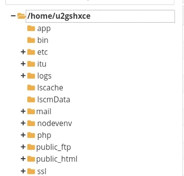
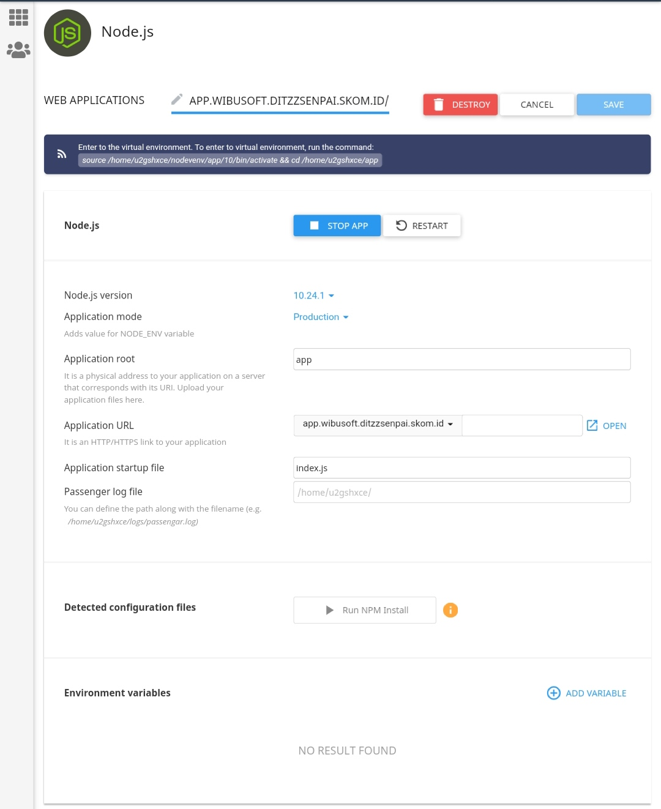

### TUTORIAL INSTALATION


``` STEP 1 ```</br>
CREATE SUBDOMAIN</br>
***NOTE : DONT USE PUBLIC_HTML***
Just like this, dont use folder inside public_html


``` STEP 2 ```</br>
IN SETUP NODE JS FOLLOW LIKE THIS, THE FOLDER MUST BE OUTSIDE PUBLIC_HTML


### DONT FORGET CLICK RUN INSTALL NPM
